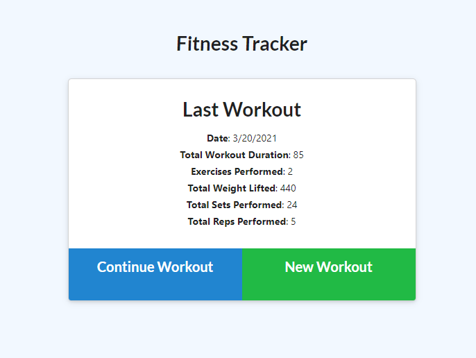
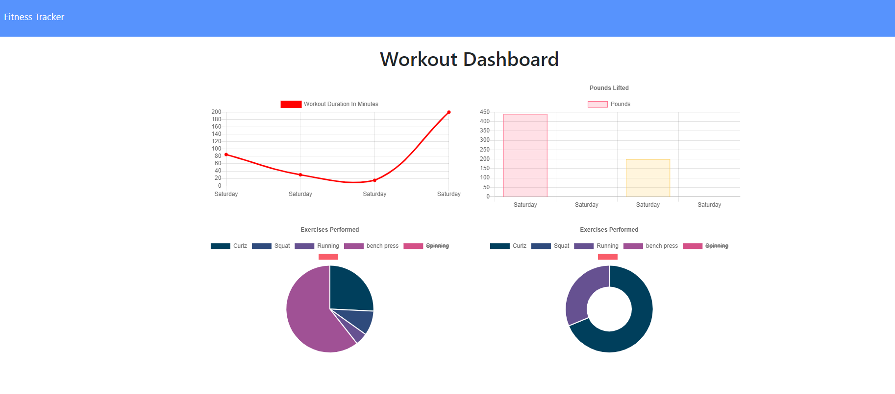

# Reps-for-Woz

 
 
This application is covered by the Mozilla license.

## Table of Contents
- [Description](#Description)
- [Installation](#Installation)
- [Usage](#Usage)
- [Lincense](#Lincense)
- [Contributing](#Contributing)
- [Tests](#Tests)
- [Questions](#Questions)

## Description  :clipboard:

### User Story
* As a user, I want to be able to view create and track daily workouts. I want to be able to log multiple exercises in a workout on a given day. I should also be able to track the name, type, weight, sets, reps, and duration of exercise. If the exercise is a cardio exercise, I should be able to track my distance traveled.

### Business Context
* A consumer will reach their fitness goals more quickly when they track their workout progress.

 
Created with JS, MongoDB/Mongoose, HTMl, CSS and love :heart:.

## Installation :floppy_disk:
There is no installation for this project

## Usage :warning:
Go to the following site to view/play with the deployed version of this app:
https://pacific-fjord-46851.herokuapp.com/

## License :scroll:

 
This application is uses the Mozilla license. 

## Contributors :family:
Peter Izzo

Feel free to submit a pull request with any updates you would like to submit :)

## Tests 🧪
No tests for this project

### Screenshot of Running App

## Questions :question:
### For any issues please reach out to Peter Izzo
 
Feel free to reach out to me at  with any questions :wave: 
 
Check out the rest of my Github: https://github.com/peter-izzo :octocat: 
 

_This README was generated by [README-GEN](https://github.com/peter-izzo/README-GEN) :godmode:_
